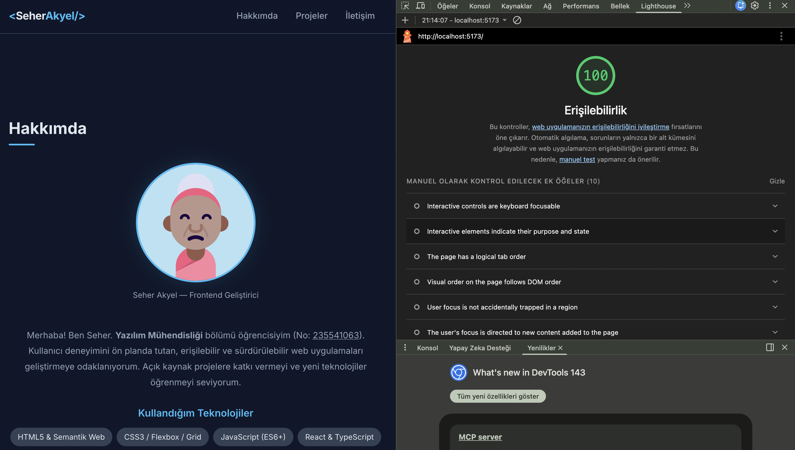

# Web LAB-1 - Hello Project

Bu proje, Web Tasarımı ve Programlama dersi LAB-1 kapsamında
Vite + React + TypeScript kullanılarak oluşturulmuştur.

## Geliştirici

- **Ad Soyad:** Seher Akyel
- **Öğrenci No:** 235541063
- **Bölüm:** Yazılım Mühendisliği

## Kullanılan Teknolojiler

- React 18
- TypeScript
- Vite
- CSS3

## Kurulum

```bash
npm install
```

## Çalıştırma

```bash
npm run dev
```

Tarayıcıda `http://localhost:5173` adresini aç.

## Proje Yapısı

```
web-lab-hello/
├── src/
│   ├── App.tsx        # Ana bileşen
│   ├── App.css        # Bileşen stilleri
│   ├── index.css      # Global stiller
│   └── main.tsx       # Uygulama giriş noktası
├── public/
├── index.html
├── package.json
├── vite.config.ts
└── tsconfig.json
```

## Özellikler

- 🎨 Modern karanlık tema (dark mode)
- 👤 Geliştirici kişisel bilgi kartı
- 🛠 Kullanılan teknoloji listesi
- 📚 Proje açıklaması
- 🎯 Hobiler bölümü
- 📱 Mobil uyumlu tasarım

## Ekran Görüntüsü

> `npm run dev` ile projeyi başlatıp `http://localhost:5173` adresini ziyaret edin.

## Erişilebilirlik (a11y) Testi

Lighthouse Erişilebilirlik skorum (Hedef 90+):
> ÖDEV TESLİMİ ÖNCESİ BURAYA EKRAN GÖRÜNTÜSÜNÜ EKLEYİNİZ. 
